The journey of building [pickGPU](https://pickgpu.com) started with a problem: I just wanted to know which graphics card to buy.

## Phase 0: The Google Sheet

Before there was a website, there was a spreadsheet. I was trying to figure out which GPU offered the best value, so I started pulling benchmark data from Tom's Hardware and comparing it against live prices to calculate a simple $/fps metric.

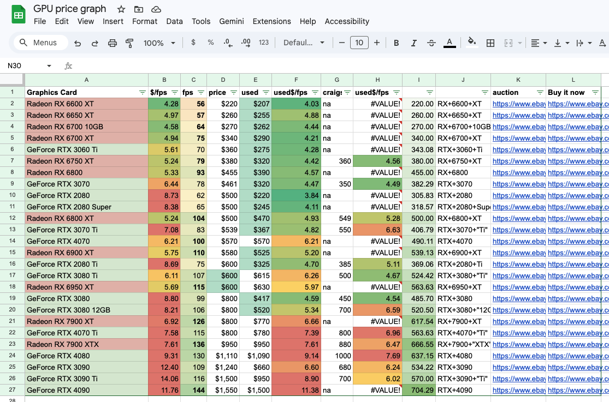

A coworker noticed what I was doing and suggested it might be useful to others. That was the spark. I was excited to dive into my first real personal project.

## The MVP: May - July 2023

Coming from a backend background, building a full web application was daunting. I reached out to my friend and coworker, Kuba, who was also looking for a project to sink his teeth into. We decided to team up: I would handle the backend while Kuba worked on the frontend.

The first commit was made on May 4, 2023. From there, we spent the next few months turning the spreadsheet idea into something people could actually use in a browser.

By July 10, 2023, we had tagged `v0.0.1`: the first real MVP of pickGPU. It was a Flask and React application, and it was basic but functional: Tom's Hardware benchmark data, Amazon and eBay price data, a sortable GPU table, filters, and rough value-per-FPS calculations.

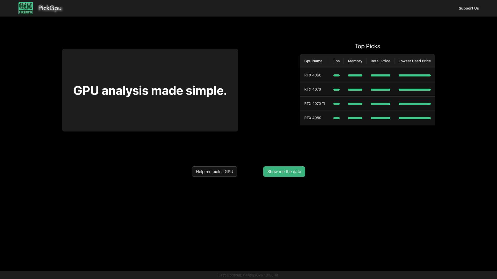

At this stage, the "Help me pick a GPU" feature wasn't working yet, but the core table and filter drawer were live. The spreadsheet idea had become something interactive: you could sort cards, compare new and used prices, and start to reason about performance against cost. Also we had an idea for Top Picks really early on.

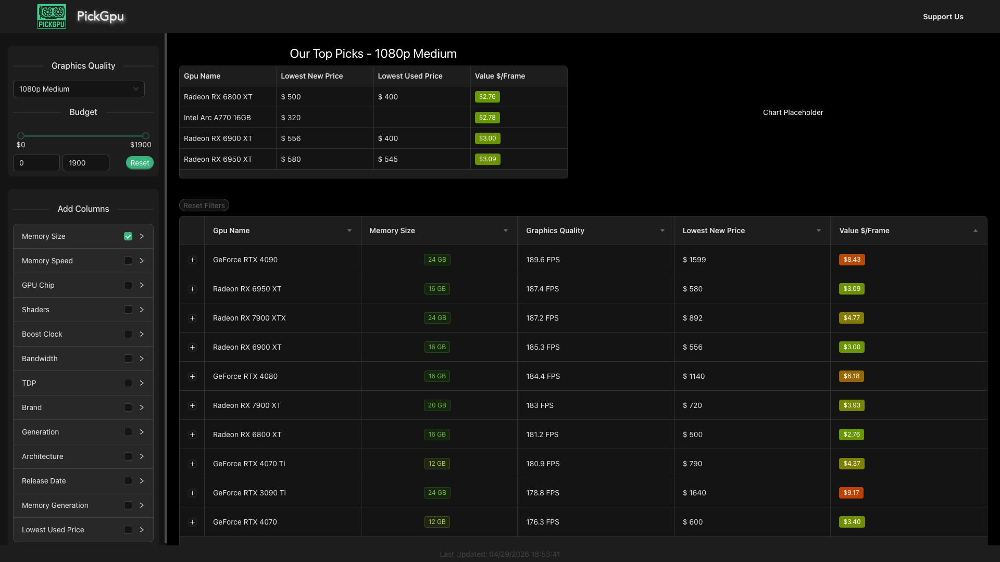

You could also expand rows to see the Amazon and eBay listings behind the numbers, which was important because the site was trying to answer the original question: what can I actually buy right now?

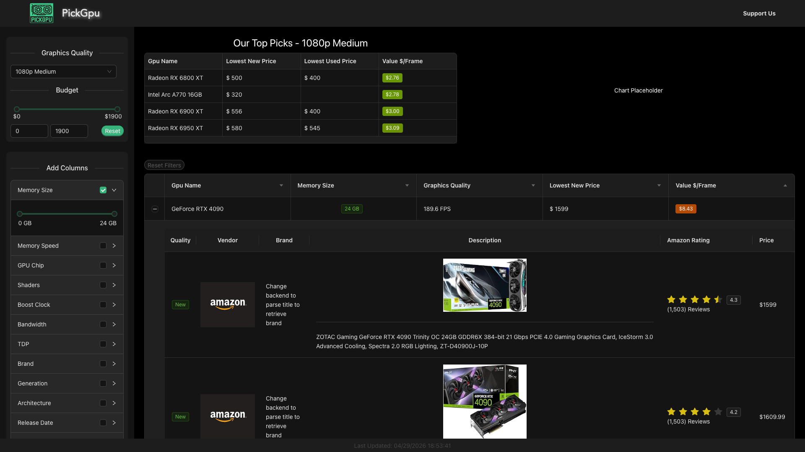

Mobile was not ready yet. The MVP proved the idea, but it was still very much a desktop-first tool.

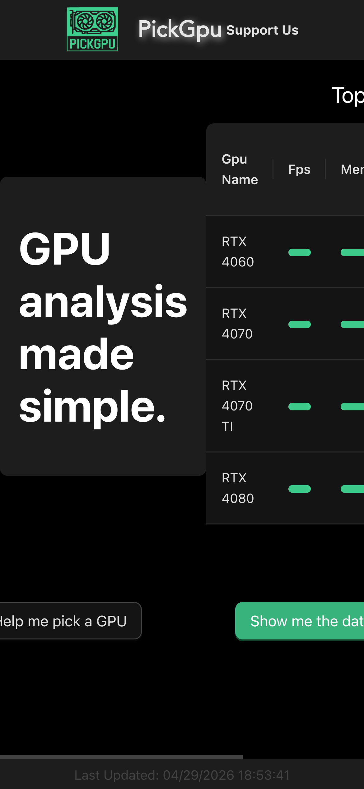

## Refinements Leading Up to Launch

By November 2023, pickGPU had moved beyond the original sortable table into something closer to a real product. We refined the homepage, added dedicated views for the table view, top picks, and plot view.

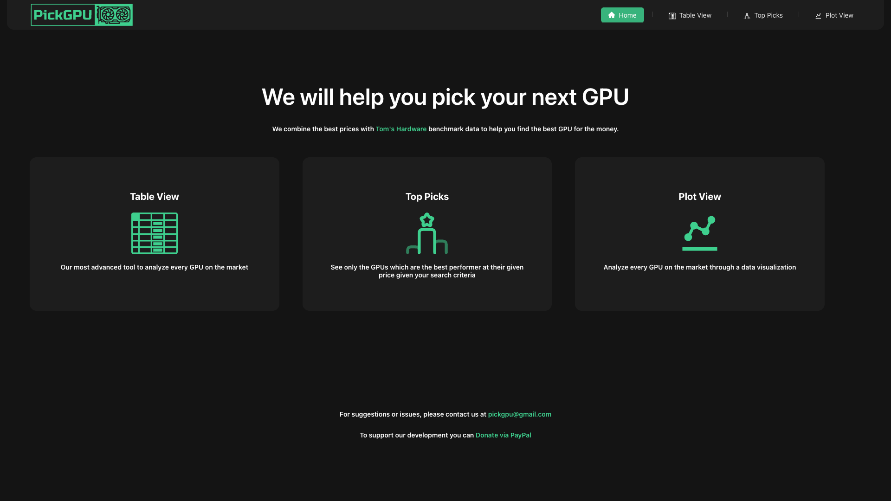

The table view became much easier to use. It was still dense, but the filtering, sorting, and value labels made the core workflow clearer than the MVP version.

We also fleshed out the Top Picks page, which included a survey to tailor recommendations to their needs.

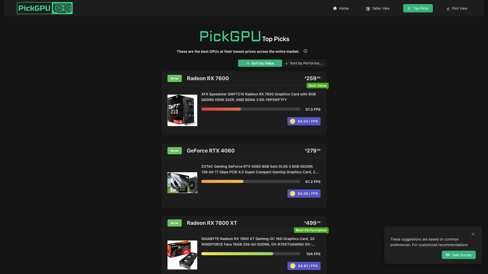

And we added a plot view to allow users to visualize the data.

Mobile was mostly functional by this point, which was a big step forward from the MVP.

But it was still missing polish for example the experience felt a bit cramped at times.

The table view was essentially unusable on phones so we decided to blocked it for the time being thinking that most of our users would be using a desktop anyway.

And the plot view clearly needed some work.

## The Reddit Launch

On November 11, 2023, we finally felt ready to share pickGPU with the world. We posted to the [r/webdev](https://www.reddit.com/r/webdev/comments/17t55mk/roast_my_website_built_to_help_you_pick_your_next/) subreddit.

It did not go exactly as expected. The feedback was "honest," to say the least, but it gave us a mountain of improvements to work on. The pre-launch version had come a long way from the MVP, but sharing it with strangers made the remaining gaps much more obvious.

The biggest issue was that the site was not reliably loading. People were seeing failed API requests, infinite skeleton loaders, blank pages, and routes that never returned data. On mobile, the problems were even more obvious: the table was blocked, the navigation felt cramped, and several users closed the site before they could really evaluate the idea.

There was also an infrastructure lesson hiding in the launch. We were running on a tiny EC2 `t2.micro`, and at the time we were not aware of CPU credit balance. My best guess for why we had filed API requests was that the Reddit traffic burned through those credits quickly, which made the site feel much worse right when the most people were trying it.

The feedback was not all negative, though. A few people liked the concept and the visual direction once the site was reachable. The useful criticism was that the product needed to be faster, more resilient, more mobile-friendly.

## The Hiatus

After the intensity of the launch and the subsequent feedback, the project entered a period of quiet. Life got busy, and for a while, pickGPU sat as it was—a useful tool, but one that needed a deeper architectural shift to truly scale and provide the experience we wanted. This break allowed for a fresh perspective when it was finally time to return.

## The 2026 Revival

In early 2026, a layoff gave me an unexpected push to return to pickGPU. I suddenly had the time, motivation, and urgency to revisit the project with a lot more experience than I had in 2023.

The revival was not just a visual refresh; it was a full architectural rebuild. The backend moved from a single Flask app that kept its working data in module-level pandas DataFrames to a FastAPI service backed by scheduled refresh jobs, structured logging, SQLite persistence, and caching.

The biggest backend change was introducing SQLite. Instead of recomputing everything into in-memory globals and hoping the process stayed healthy, pickGPU now loaded Tom's Hardware data, validated Amazon/eBay listings, current prices, and historical prices into database tables. That gave us a real cache between expensive scraping/validation work and the user-facing site.

The frontend changed shape too. We moved to React Query for server state and TanStack Router for route structure, which made the app feel less like a collection of pages calling ad hoc endpoints and more like a product with consistent data loading, route-specific views, and shared filtering behavior.

The first visible result was a new version of pickGPU that already felt much more intentional. The homepage was cleaner, the product had a clearer identity, and the main paths through the app were organized around Top Picks, Table View, and Plot View.

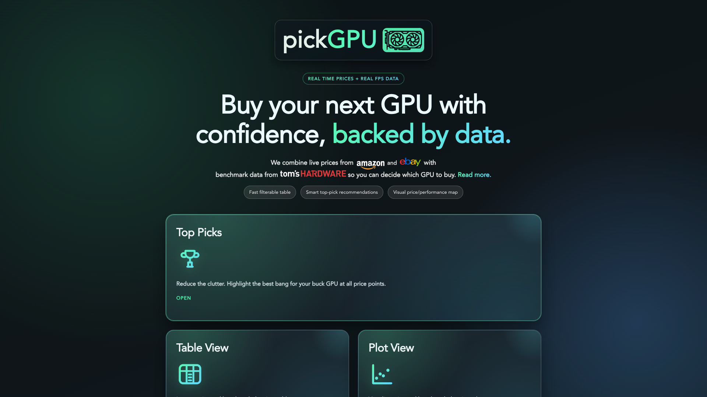

Top Picks became less of a survey result page and more of a direct recommendation view. It focused on showing the best value GPUs at their lowest available prices, with filters and sorting built around the way people were actually comparing cards.

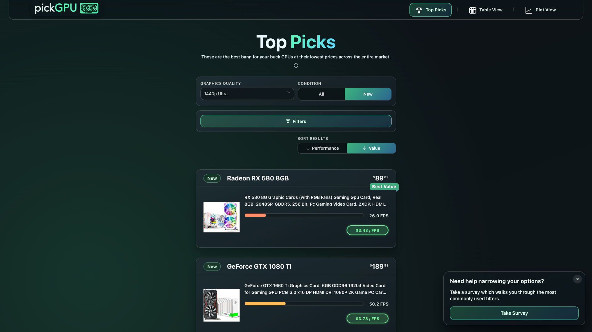

The table also came back in a much more polished form. It kept the dense comparison workflow from the original project, but the layout, controls, and visual hierarchy were all much clearer.

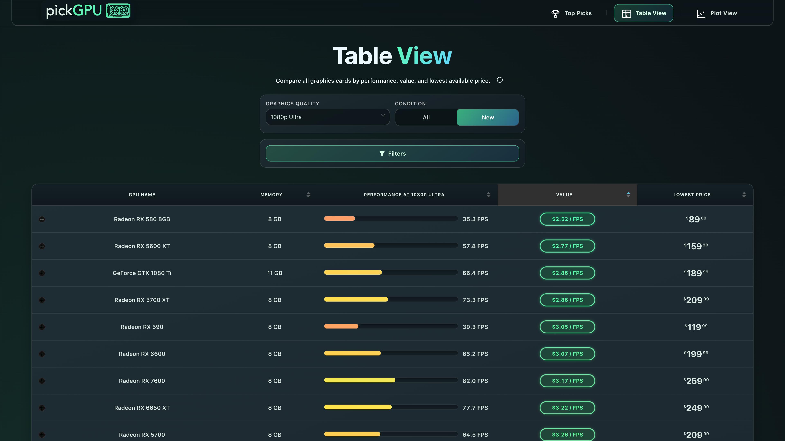

The plot view returned too, still centered on the original idea of visualizing price against performance.

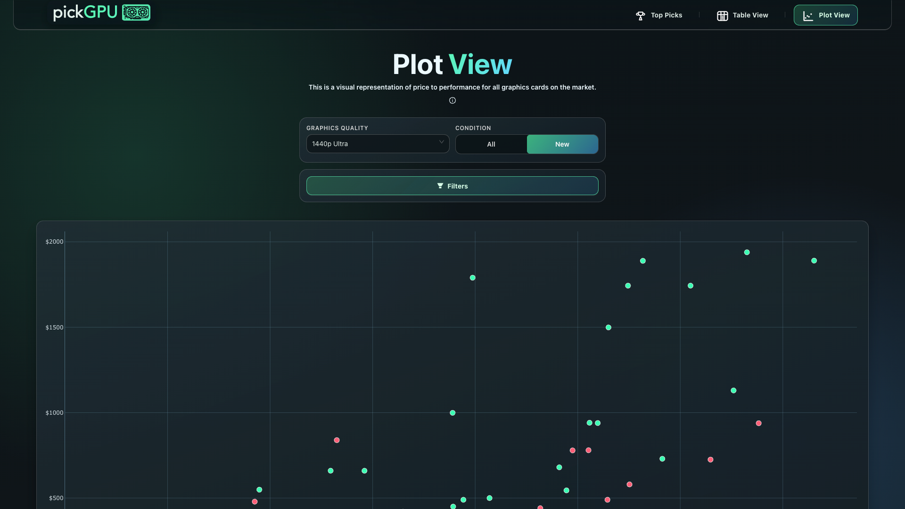

The mobile experience was also no longer an afterthought. It still was not the final version of the site, but compared with the 2023 launch it was a major step forward.

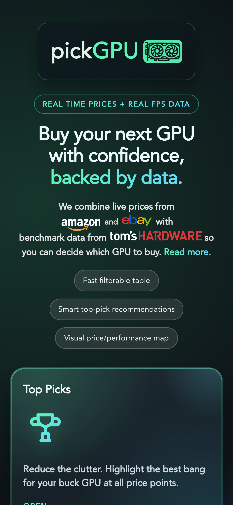
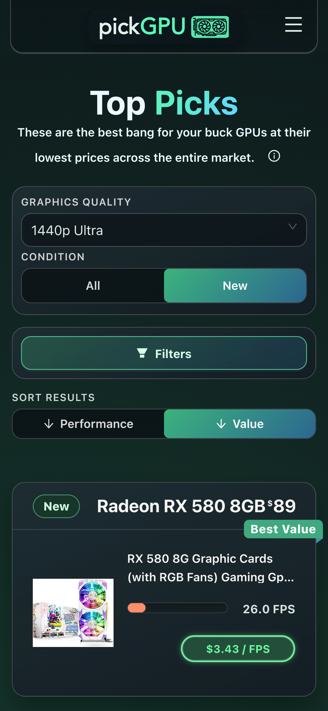
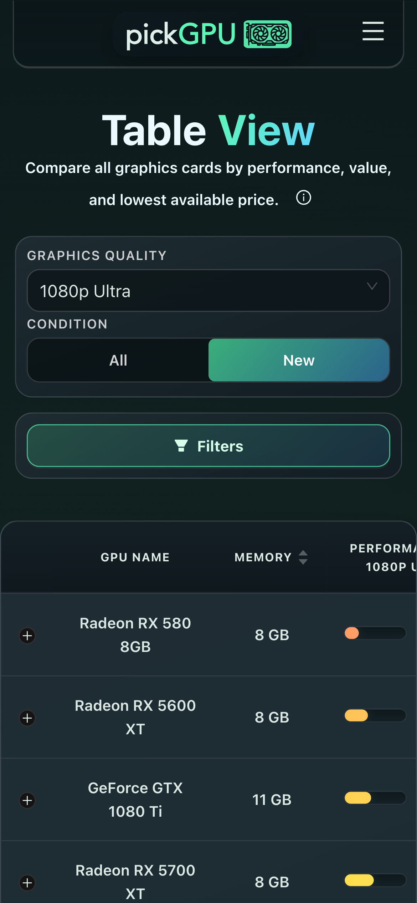
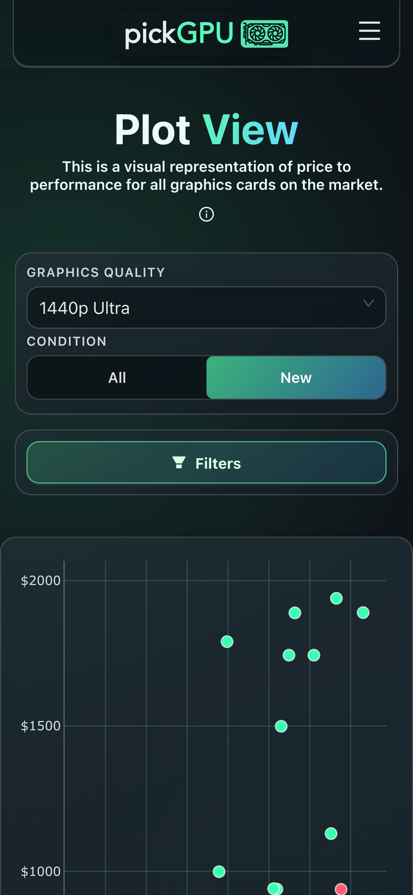

## Final Polish and the Modern Experience

With the new architecture in place, we turned our focus to the final polish. This era brought the modern pickGPU experience you see today: a clearer homepage, top picks, table and compare views, custom benchmark support, pricing across multiple retailers, and—finally—a responsive design where mobile is no longer an afterthought.

The homepage also came back around to the original MVP idea. The main call to action became "Find My GPU," a more polished version of the early "Help me pick a GPU" flow we had wanted from the beginning.

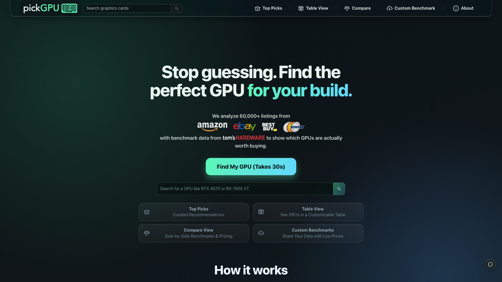

Top Picks and Table View also became more useful by bringing the plot directly into both workflows and adding listing previews. Instead of forcing users to jump between separate pages to understand price, performance, and the actual listings behind a recommendation, the modern site puts more of that context in one place.

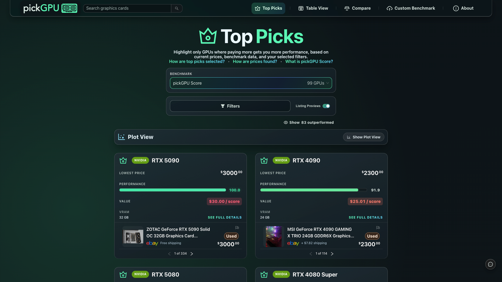

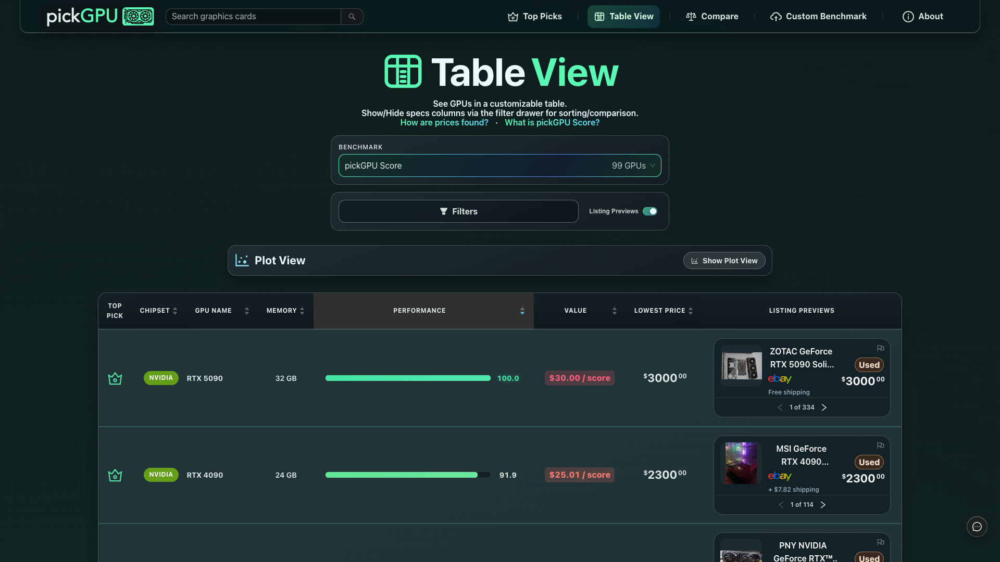

The latest version also includes workflows that did not exist in the original project, including side-by-side GPU comparisons and custom benchmark uploads that let users bring their own performance data.

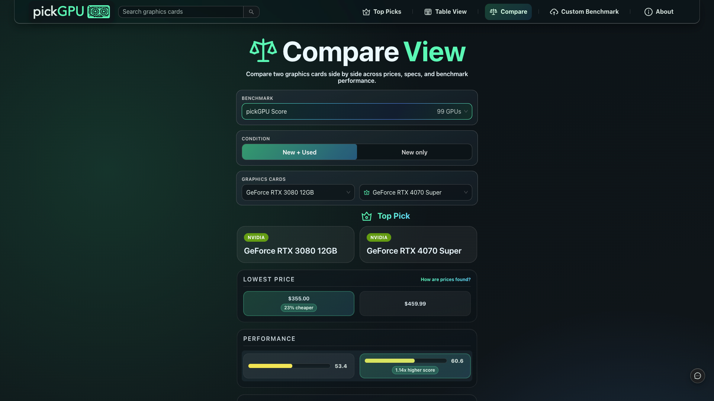

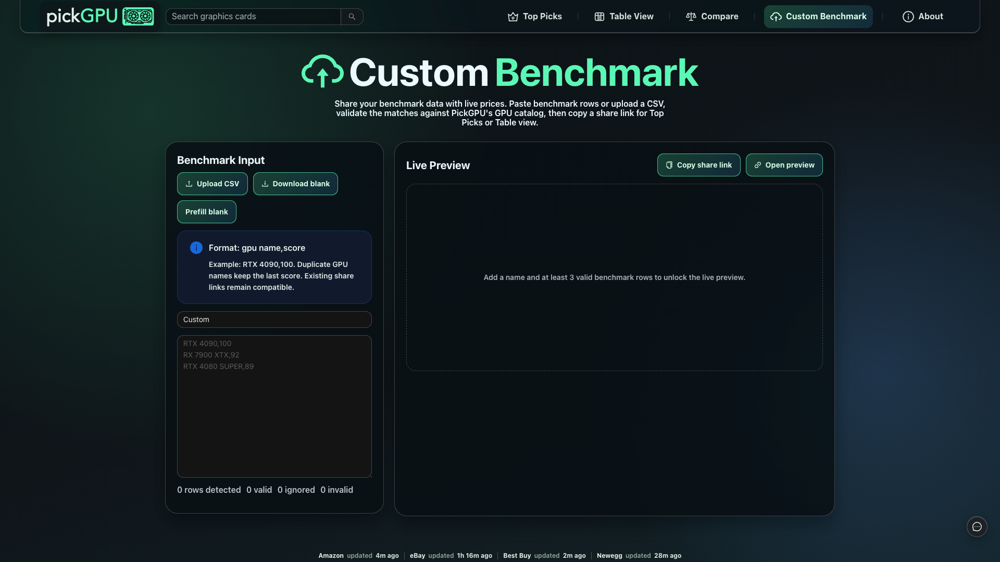

The about page also became part of the product, explaining how prices, benchmarks, and pickGPU Score work instead of leaving users to infer the logic from the table.

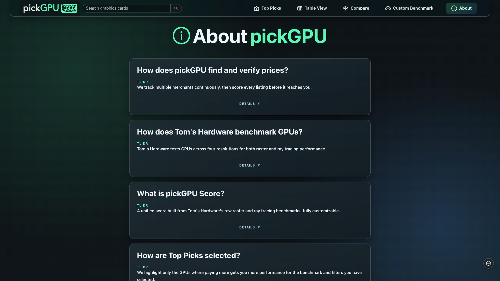

Mobile finally got the polish it deserved. Instead of being a compromised version of the desktop site, the main workflows became comfortable to use from a phone.

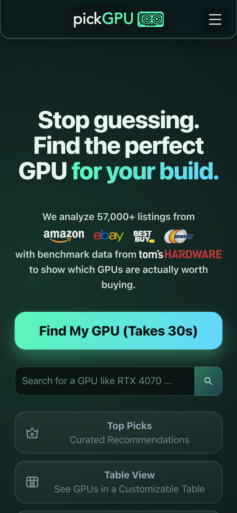
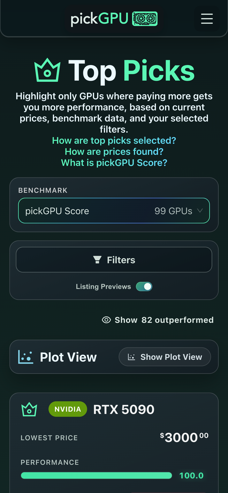
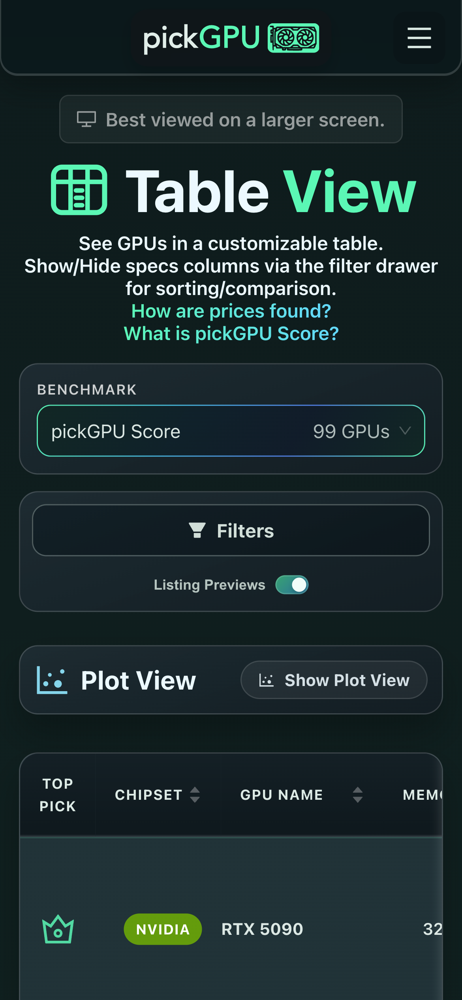
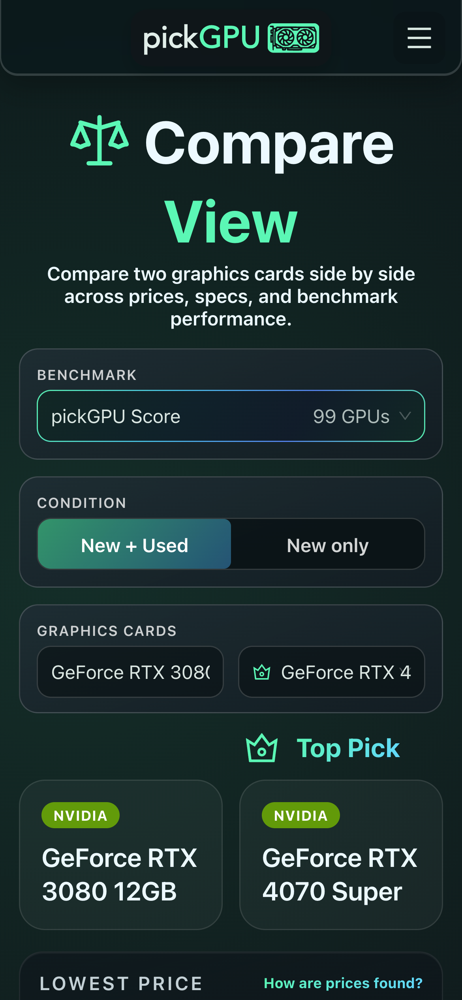
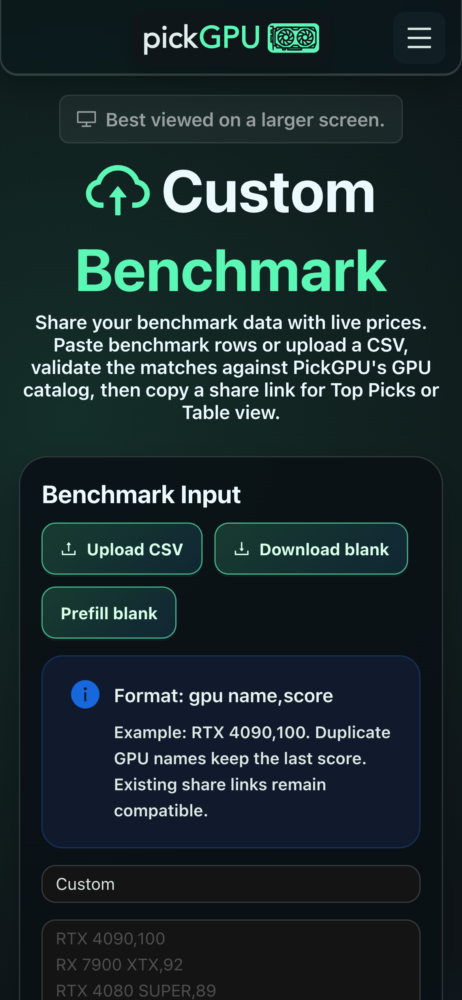

pickGPU has come a long way from that first Google Sheet, and it's been an incredible learning experience every step of the way.
