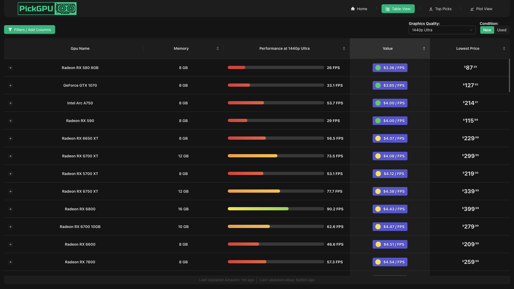
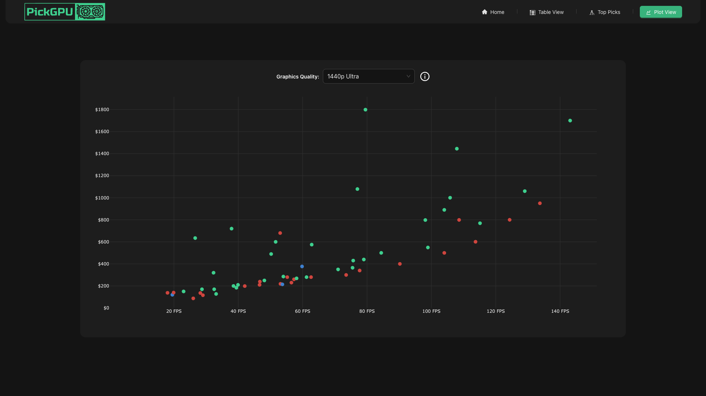
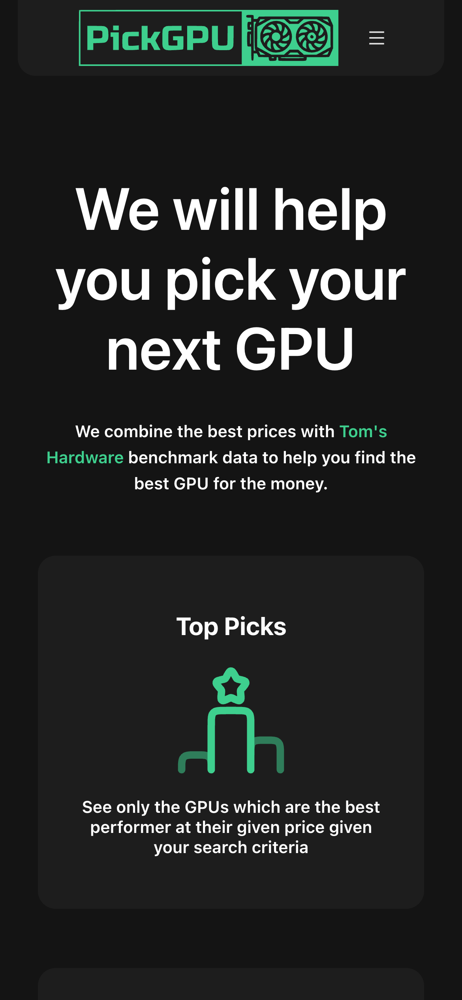
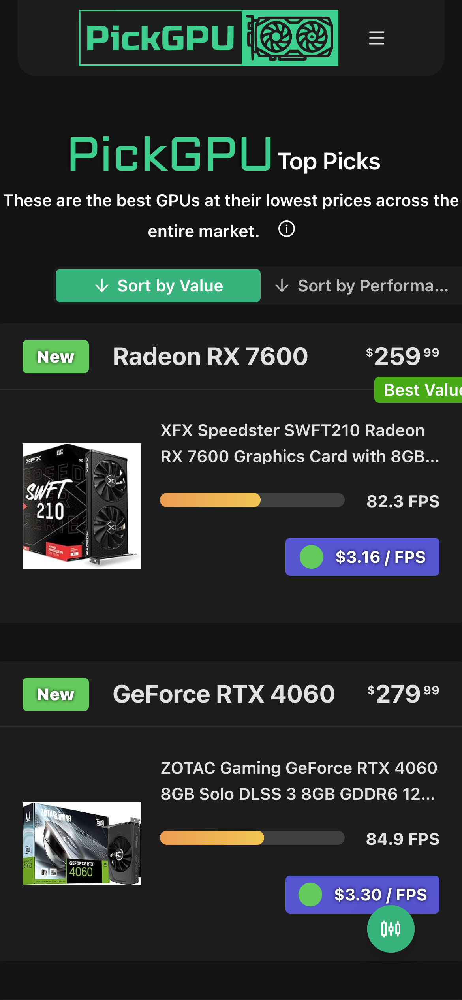
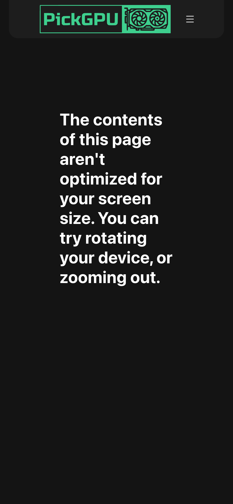
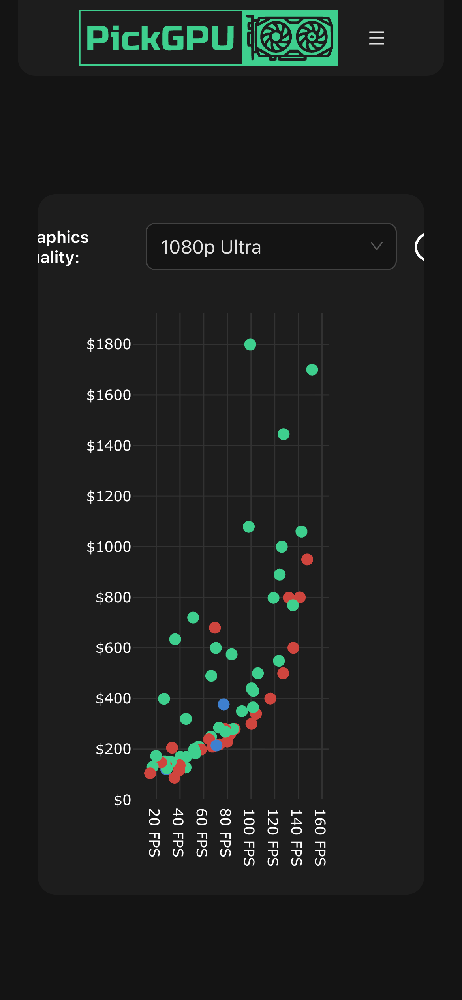

The journey of building [pickGPU](https://pickgpu.com) started with a problem: I just wanted to know which graphics card to buy.

## Phase 0: The Google Sheet

Before there was a website, there was a spreadsheet. I was trying to figure out which GPU offered the best value, so I started pulling benchmark data from Tom's Hardware and comparing it against live prices to calculate a simple $/fps metric.

A coworker noticed what I was doing and suggested it might be useful to others. That was the spark. I was excited to dive into my first real personal project.

## The MVP: May - July 2023

Coming from a backend background, building a full web application was daunting. I reached out to my friend and coworker, Kuba, who was also looking for a project to sink his teeth into. We decided to team up: I would handle the backend while Kuba worked on the frontend.

The first commit was made on May 4, 2023. From there, we spent the next few months turning the spreadsheet idea into something people could actually use in a browser.

By July 10, 2023, we had tagged `v0.0.1`: the first real MVP of pickGPU. It was a Flask and React application, and it was basic but functional: Tom's Hardware benchmark data, Amazon and eBay price data, a sortable GPU table, filters, and rough value-per-FPS calculations.

.png)

At this stage, the "Help me pick a GPU" feature wasn't working yet, but the core table and filter drawer were live. The spreadsheet idea had become something interactive: you could sort cards, compare new and used prices, and start to reason about performance against cost.

.png)

You could also expand rows to see the Amazon and eBay listings behind the numbers, which was important because the site was not just ranking GPUs in the abstract. It was trying to answer the original question: what can I actually buy right now?

_(1).png)

Mobile was not ready yet. The MVP proved the idea, but it was still very much a desktop-first tool.

.png)

## Refinements Leading Up to Launch

By November 2023, pickGPU had moved beyond the original sortable table into something closer to a real product. We refined the homepage, added dedicated views for the table, top picks, suggestions, and plots, and built a survey that let users tailor recommendations to their needs.

The table view became much easier to use. It was still dense, but the filtering, sorting, and value labels made the core workflow clearer than the MVP version.

We also fleshed out the Top Picks page. It included a survey, which let users get recommendations based on their budget, target resolution, graphics quality, and other preferences.

And we added a plot view to make the price-to-performance tradeoffs more visual.

Mobile was mostly functional by this point, which was a big step forward from the MVP.

But it was still missing polish. The experience felt cramped.

The table view was basically unusable on phones so we decided to blocked it for the time being.

And the plot view clearly needed some work.

## The Reddit Launch

On November 11, 2023, we finally felt ready to share pickGPU with the world. We posted to the [r/webdev](https://www.reddit.com/r/webdev/comments/17t55mk/roast_my_website_built_to_help_you_pick_your_next/) subreddit.

It did not go exactly as expected. The feedback was "honest," to say the least, but it gave us a mountain of improvements to work on. The pre-launch version had come a long way from the MVP, but sharing it with strangers made the remaining gaps much more obvious.

The biggest issue was that the site was not reliably loading. People were seeing failed API requests, infinite skeleton loaders, blank pages, and routes that never returned data. On mobile, the problems were even more obvious: the table was blocked or unusable, the navigation felt cramped, and several users closed the site before they could really evaluate the idea.

There was also an infrastructure lesson hiding in the launch. We were running on a tiny EC2 `t2.micro`, and at the time we were not aware of CPU credit balance. My best guess is that the Reddit traffic burned through those credits quickly, which made the site feel much worse right when the most people were trying it.

The feedback was not all negative, though. A few people liked the concept and the visual direction once the site was reachable. The useful criticism was that the product needed to be faster, more resilient, more mobile-friendly, and clearer about what the benchmark numbers meant.

## The Hiatus

After the intensity of the launch and the subsequent feedback, the project entered a period of quiet. Life got busy, and for a while, pickGPU sat as it was—a useful tool, but one that needed a deeper architectural shift to truly scale and provide the experience we wanted. This break allowed for a fresh perspective when it was finally time to return.

## The 2026 Revival

In early 2026, the revival began. This wasn't just a few tweaks; it was a massive architectural rebuild. We moved the backend from Flask to FastAPI, transitioned to a more robust SQLite/CSV data pipeline, and completely modernized the frontend with React Query and TanStack Router.

This technical foundation was crucial for creating a more resilient and faster application.

_(7).png)

## Final Polish and the Modern Experience

With the new architecture in place, we turned our focus to the final polish. This era brought the modern pickGPU experience you see today: a clearer homepage, top picks, table and compare views, custom benchmark support, pricing across multiple retailers, and—finally—a responsive design where mobile is no longer an afterthought.

.png)

The table view finally became what we had envisioned years ago—dense, informative, and easy to filter, with listing previews built directly into the workflow.

_(5).png)

_(1).png)

The latest version also includes workflows that did not exist in the original project, including side-by-side GPU comparisons and custom benchmark uploads that let users bring their own performance data.

_(2).png)

_(3).png)

The about page also became part of the product, explaining how prices, benchmarks, and pickGPU Score work instead of leaving users to infer the logic from the table.

_(4).png)

.png)

pickGPU has come a long way from that first Google Sheet, and it's been an incredible learning experience every step of the way.
